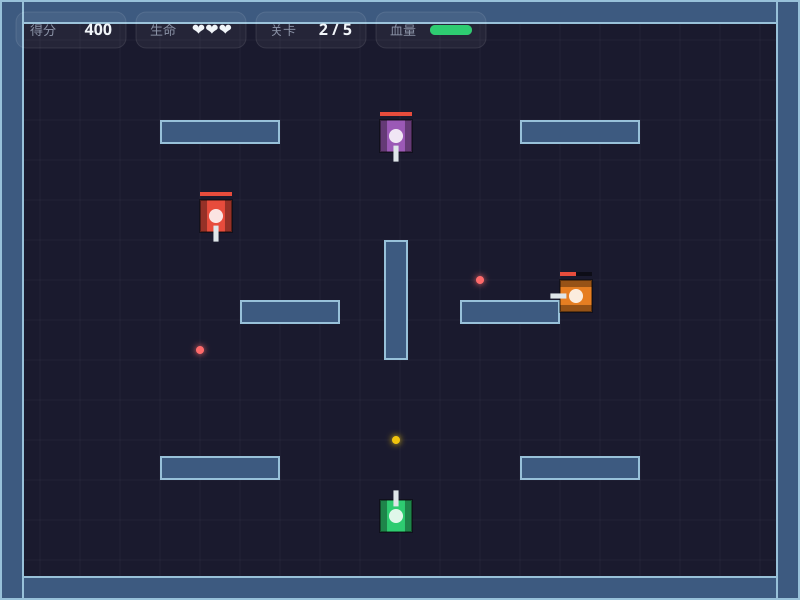
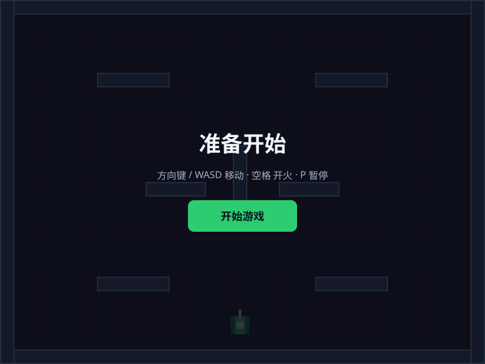
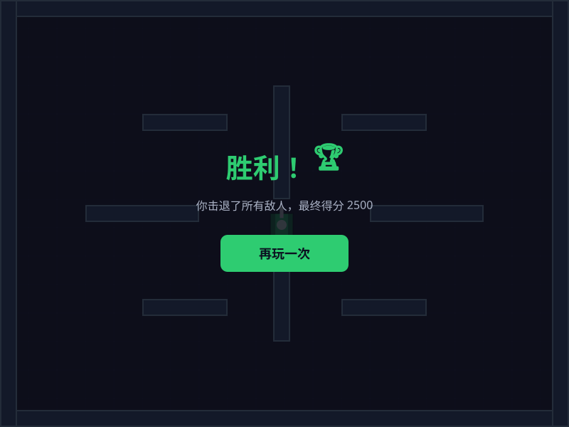

# 🎮 坦克大战 (Tank Battle)

基于 **Next.js 16 + TypeScript + HTML5 Canvas** 实现的经典坦克大战游戏。

<p align="center">
  
</p>

<p align="center"><em>游戏进行中 —— 玩家（绿色）对抗多辆敌方坦克，注意 HUD 上的得分、生命与血量</em></p>

---

## ✨ 游戏截图

### 开始界面
<p align="center">
  
</p>

### 胜利界面
<p align="center">
  
</p>

> 截图由 `scripts/gen-screenshots.mjs` 依据游戏引擎的真实绘制逻辑与配色生成（SVG，无额外依赖）。

---

## 🚀 快速开始

```bash
# 安装依赖
npm install

# 开发模式（http://localhost:3000）
npm run dev

# 生产构建
npm run build
npm run start
```

打开浏览器访问 <http://localhost:3000> 即可开始游戏。

---

## 🎯 玩法与操作

| 操作 | 按键 |
|------|------|
| 移动 | `↑` `↓` `←` `→` 或 `W` `A` `S` `D` |
| 开火 | `空格` |
| 暂停 / 继续 | `P` |
| 开始 / 重新开始 | `Enter` 或点击按钮 |

> 📱 移动端：屏幕下方提供虚拟方向键与「开火」按钮。

### 游戏规则

- 控制绿色坦克消灭所有敌方坦克。
- 每辆敌方坦克需要 **2 发子弹** 才能击毁（顶部有红色血条）。
- 被敌方子弹击中会损失血量，血量归零损失一条生命。
- 生命耗尽则游戏结束；通过全部 **5 个关卡** 即获胜。
- 每关地图布局不同，敌人数量、速度、血量随关卡提升。

---

## 🕹️ 游戏特性

- **玩家坦克**：四方向移动，边移动边开火
- **敌方 AI**：自动追踪玩家、对齐时开火、随机巡逻
- **关卡系统**：5 个关卡，每关地图布局不同，难度递增
- **碰撞系统**：坦克↔墙、坦克↔坦克、子弹↔墙/坦克（AABB + 圆-矩形检测）
- **HUD**：实时得分、生命（❤）、关卡进度、玩家血条
- **响应式设计**：桌面端键盘操作，移动端虚拟摇杆
- **固定 60 FPS 逻辑步进**：使用 accumulator 模式，不同刷新率下速度一致

---

## 📁 项目结构

```
tank-battle/
├── app/
│   ├── page.tsx              # 首页，挂载游戏组件
│   ├── layout.tsx            # 布局 + 元数据
│   ├── globals.css           # 全局深色主题
│   └── TankGame.module.css   # 游戏 UI 样式
├── components/
│   └── TankGame.tsx          # 游戏 React 组件（状态/HUD/输入/渲染循环）
├── lib/game/
│   ├── types.ts              # 类型定义
│   └── engine.ts             # 游戏引擎（物理、AI、碰撞、绘制）
├── public/
│   └── screenshots/          # README 截图
├── scripts/
│   └── gen-screenshots.mjs   # 截图生成脚本
└── ...
```

---

## 🧩 架构说明

游戏逻辑与 React 完全解耦，便于测试与复用：

- **`lib/game/engine.ts`** —— 纯函数式游戏引擎
  - `createInitialState()` 创建初始状态
  - `update(state, input)` 推进一帧模拟（移动、AI、碰撞、计分）
  - `draw(ctx, state)` 负责 Canvas 渲染
- **`components/TankGame.tsx`** —— 负责：
  - 用 `requestAnimationFrame` 驱动固定 60 FPS 循环
  - 收集键盘 / 触摸输入到 `InputState`
  - 把引擎状态同步到 React HUD

---

## 🔧 技术栈

- [Next.js 16](https://nextjs.org/)（App Router）
- [TypeScript](https://www.typescriptlang.org/)
- HTML5 Canvas 2D API
- CSS Modules

---

## 📄 License

MIT
